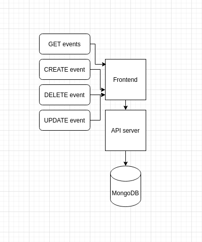

# Приложение для отображения колеса года

Ссылка на рабочую версию: https://kogda-sobitie.netlify.app  
Адрес API: https://api.kogda-sobitie.ga:8443/events

## Архитекутра:

## Инструкция для разработчиков:
1. Скачать Git репозиторий
2. Установить NVM и последний node - https://github.com/nvm-sh/nvm
3. Установить Ionic Framework (Vue): https://ionicframework.com/docs/vue/quickstart
4. В корне репозитория выполнить `ionic serve`
5. Запросить доступ к доксе Trello с задачами - https://trello.com/b/ZxkFGJfX/kogda-sobitie
